# Assembly Programming NOTEs

## 一、基础知识

### 在计算机系统结构种的定 位、指令 系统概念及分类。




### 课程内容与目标

### 指令集简介

#### x86指令集——CISC

* 基本特点

  * 向下兼容（历史包袱不能丢）

  * 变长指令

    1-15字节，多数为2-3字节长度

    <u>码字利用率较高</u>

    <u>译码复杂</u>

  * 多种寻址方式（可访问不对齐内存地址）

  * 通用寄存器个数有限（x86-64拓展到16个）

  * 至多能有一个操作数在内存中，另一个操作数为立即数或者寄存器

* x86-32/64 General Purpose Registers

  

  

* x86指令集缺点

  * 向下兼容导致指令集越来越大和复杂

  * 类RISC内核，采用micro-op模式进行翻译，功耗增大

  * 很多领域，资源利用率低

    300多条指令中，高性能计算机行业基本只用80条指令。

#### MIPS指令集——经典的RISC指令集

以寄存器为中心（32个），只有Load/Store指令访问内存。

......

RIJ三类指令。

#### ARM指令集——有些不同的RISC指令集（32位）

“条件执行”模式

16位压缩指令集（Thumb）

#### 小结

CISC与RISC走向融合

ARM博取众长

兼容性是必要因素

### 整数的机器表示

#### 数制

字：

* x86 2byte
* mips 4byte

#### 数的机器表示

* **机器字长**：一般指计算机进行一次整数运算所能处理的二进制数据的位数。（通常也包括数据地址长度）

  * 32位字长

    4GB

  * 64位

    实际上支持48位宽的地址：256TB

#### 机器字在内存中的组织




* 字节序

  大端/小端

  

  

#### C语言类型宽度




### 无符号整数与带符号整数




```C
#define DELTA sizeof(int)
// sizeof()返回unsigned
```

#### 加法溢出

**无符号数加法**：<u>溢出</u>，C语言默认不检测高位溢出

**补码加法**：与无符号一致

**<u>补码加法的溢出</u>**




* 两 大正数 相加，溢出到符号位得到负数。

  两个大于0100...0的数相加，必进位到符号位，并变为负数。

* 两 大负数 相加，“溢出到”符号位得到正数。

  如两个比1011...1大的负数（如1011...0），相加由于不会进位到最高位，那么最高为的两个1相加则溢出，得到结果的最高为0，变为正数。

#### 除法

* 无符号整数除以2^k

  逻辑右移

* 带符号数除以2^k

  算术右移

  * 但是x<0时，舍入错误

    因为丢弃掉小数点部分时，实际上是让该数绝对值变小了，则该负数在计算机中也变小了（如1011，直接算术右移1位则变为1001.1(当然这个小数点完全不严谨，只是说明问题用，说明它包含一个小数)，去掉小数点变为1001，变小了）。

    但是对应到负数除法期望向0舍入，也就是变大的期望是相反的（如-12.13去掉小数点为-12，变大了）。

    * **解决方法：**计算之前加一个矫正量**<u>((2^k)-1)</u>**

      为什么加这么多可以看视频（8:00左右）

    * **思考：**11111111的除法，如果加一个(2^k)-1岂不是最高位进位了（k=1除外）？它还是不是正确的？

      **简单想了一下**，应该是正确的。

      **而且**，这是一种<u>特殊情况</u>，对于一般的情况，问题应该大致是这样：

      对于一个负数-x(x>0)，当它除以一个数y，且y>x时，对于所加的矫正量(2^k)+1，将导致该有符号的负数变为有符号的非负数(比如11...1加上1变为00...0，因此是包括0的非负数)，且算术右移后变为0。

      **同时**，这又引出一个新的问题：当这个除数y过大，已经>=该有符号数的长度w时，这里的矫正量加法就得有些变化了，具体怎么处理我也不清楚，但是从逻辑上来讲，还是成立的，毕竟你加上(2^y)-1后，再右移y位，那么也是直接得到0，也是正确的。

### 浮点数的机器表示

#### IEEE的浮点数标准

##### 规格化和非规格化表示










* 浮点数种类

  * 规格化浮点数（Normalized）

    

    

    * **满足条件**

      $\text{exp} \neq 000\ldots1$且$\text{exp} \neq 111\ldots1$
  
    * **偏置量**
  
      减去**<u>偏置量</u>**的原因：
  
      实际的Exp是作为一个无符号数存储，是一个大于零的整数。所以为了表示如-1等负数次方，就将原本的负数加上一个偏置量Bias，从而将负数表示为正数。
  
      其中：
  
      $\text{Bias}=2^{e-1}-1,e=\text{exp域的位数}$
  
    * **前导1**：frac第一位隐含为1（节省空间）
  
  * 非规格化浮点数（Denormalized）
  
    它其实也就是用来表示规格化浮点数由于<u>**前导1和exp阶数不够**</u>而无法表示的更小的数。如果要表示更小的数，就需要丧失精度（<u>逐步丧失精度</u>），比如：$0.000\ldots01234 \times 2^{-126}$和$0.000\ldots00123 \times 2^{-126}$相比，后者的精度少了一位。
  
    > 非规格化浮点数（denormalized number,a.k.a. subnormal number）是指的计算机中处理的一类特殊浮点数。在规格化浮点数中，浮点数的尾数不应当包含前导0。如果全部用十进制表示，对于类似0.0123的浮点数，规格化的表示应为1.23e-2。但对于某些过小的数，如1.23e-130，允许的阶数位数不能满足阶数大小的需要，这时可能就会在尾数前添加前导0，如将其表示为0.000123e-126。
    >
    > ——[百度百科](https://baike.baidu.com/item/%E9%9D%9E%E8%A7%84%E6%A0%BC%E5%8C%96%E6%B5%AE%E7%82%B9%E6%95%B0/12014979?fr=aladdin)
  
    
  
    
  
    * 满足条件：
  
      $\text{exp}=000\ldots0$
  
    * Bias取值
  
    * +0与-0
  
    * 逐步丧失精度
  
  * 一些特殊的值
  
    
  
    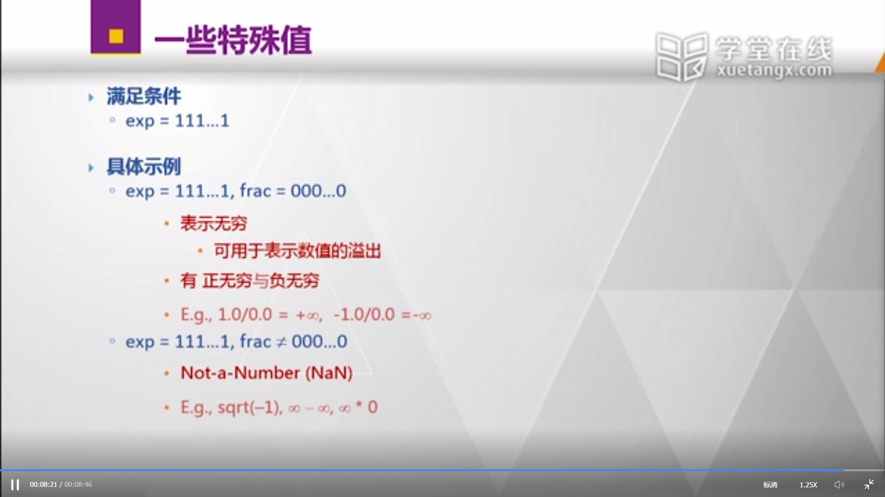
  
    * 满足条件：
    
      $\exp = 111\ldots1$

##### 浮点数表示的特性

* 浮点数在数轴上的不均匀分布：

  

  

  

  

* 表示范围的一些特例（感性认识）

  

  

* 浮点数编码的特性

  主要是比较方式可以直接采用无符号整数的方式。区别如下：

  

  

  具体的，可以看看取值范围，一目了然：
  
  
  
  

<u>**P.S. 偏置量的值一定要记住！！！**</u>

#### 给出一个实数，如何给出其浮点数表示

##### 基本流程 




* 可能会溢出
* 可能需要舍入操作

##### 向偶数舍入（Round-To-Even）的舍入方式：Nearest Even(default)










两种情况：

* 最低有效数字的右侧是1000...000的形式，那么就采用**向偶数舍入的舍入方式**（也就是保证最低有效数字为0。

  比如（小数点后保留两位时）：

  $1.01\underline{100000}$舍入后变为$1.10$，进位

  $1.00\underline{100000}$舍入后变为$1.00$，不进位

* 其余情况还是使用**四舍五入**的原则

  比如（小数点后保留两位时）：

  $1.01\underline{100001}$舍入后变为$1.10$，进位

  $1.01\underline{011111}$舍入后变为$1.01$，不进位

##### 调整

将实际值转化为浮点数再转化为实际值，值可能会变化。

value=>浮点数=>result

（这里使用的是自定义的8位浮点数，格式为：s+exp+frac，分别长为1，4，3，具体可以参见上面最近的一张图）




比如最后一个63：参照上面图中的步骤

1. 将63规格化：

   63可表示为2进制为$\underline1111\mid11$，$\exp=5$。其中下划线位为**前导1**，被竖线隔断的是将截断的位数（因为frac只有3位长）

2. 舍入

   11四舍五入进位，变为$1\underline0000\mid00$，$\exp=5$。下滑线是原本前导1的位置，说明**发生了溢出**。

   此时需要进行后调整，也就是向后移1位，那么就变为:

   $\underline1000,\exp=6$（此时已丢弃后面的精度）

3. 后调整

   舍入时，发生溢出时进行的调整，如上。

#### C语言的浮点数




**<u>习题：</u>**




答案分别为：

(x),32位的int可能产生舍入（除去符号位有31位），float精度只有23位（其实还有一位前导1，24位），比如0xffff ffff转化为浮点数会舍入，再转换回来就不对了。

(v),double够长，frac有52位。

(v),float转double当然没有精度损失。

(x),double转float当然可能有损失。

(v),只是改变了符号位。

(x),这里我认为是$2/3$结果为整型，而$2/3.0$是浮点数，所以不相等。

(v),乘法我不是清楚，但是想当然认为是不会影响到符号位的，毕竟基本就没符号位s什么事情（也不存在什么补码表示之类的）。

(v),改一下符号位而已。

(?)，视频课没有答案，大概是对的吧...符号位相乘等于正的，然后frac无论是多少都是正的。

(x),不一定吧，d+f转化为double再运算，如果d+f很大，大到超过double的表示范围，这时候可能会产生溢出吧。那么(d+f)-d就应该是不等于d了。

## 二、x86体系结构初步

### 1.计算机系统




只是一个（卡通式）逻辑表示，并不符合现在的物理架构。

### 2.存储器




### 3.80x86处理器与保护模式（可以看一下视频仅11分钟）

#### 历史







主要：




























## 三、C与汇编语言

### 80x86汇编语言与C语言-1

#### 汇编程序员眼中的系统结构

##### 概要

参照图片。四点：




##### 如何从C代码生成汇编代码




##### 汇编语言数据格式

如mov指令使用后缀表示具体的操作数的类型。




“字”的长度**x86**为16位，“双字”为32位。

#### 第一条汇编指令



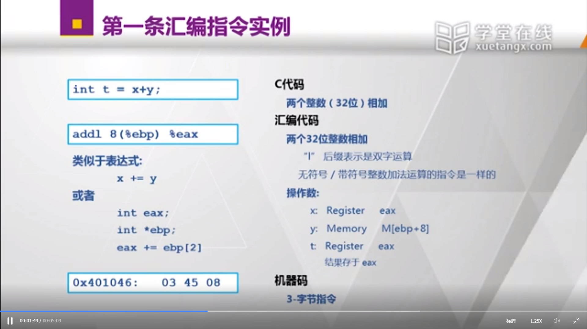







#### 直接/间接寻址




#### 寻址模式示例







...忘了就看看视频，实际上就是一个简单的函数调用。

#### 地址计算指令与其它-1

##### 变址寻址（和访问数组比较像）







##### mov指令




##### 地址计算指令leal




* 地址计算（间/直接寻址、变址寻址）
* 进行$x+k \times y$这一类型的计算（相比于直接加和乘效率更高）

##### 整数计算指令（双操作数和单操作数）







#### 地址计算指令与其他-2

leal数值计算示例：

使用imull操作数的原因是都是变量。




逻辑运算示例：




#### x86-64下通用寄存器与汇编指令——初步




32和64指针类型长度一定不相同，如char\*




注意：%ebp被解放出来了。

<u>**示例：**</u>（参数传递方式变化）




**后缀“q”表示“4字”：**




简单小结：




**简单补充：**可以使用选项编译成intel/Microsoft Format的汇编语法




练习题：




### 80x86汇编与C语言-2

#### Control Flow(控制流)

##### 回顾：




**<u>重点是</u>**条件码（实际上不止4位，还有很多，本课程主要关注这4位）

##### 条件码




加法无法检测是无符号还是有符号数加减，所以它会同时置CF和OF这两个位。当程序认为是无符号加法时，就会去检测CF位，认为是有符号加法时，就会去检测OF位。

##### 比较指令（Compare）和测试（Test）指令



 

compare指令相当于两个操作数相减。注：CF=1说明a-b借位了，也就是a<b。 

[compare指令](https://blog.csdn.net/farmwang/article/details/50194337)




Test指令相当于做一个与(and)

##### 读取条件码




[注]：

1. ......**异或^**(相同为0，不同为1)给想成**与**了....
2. 需要区分有符号和无符号

[例]：




<u>**注意：movzbl指令和movsbl指令**</u>

##### x86-64下读取条件码




[注]：**注意小字！！！**64位操作数在通用寄存器中生成64位的结果。而32位操作数<u>**在通用寄存器中**</u>生成32位的结果，但是会<u>**自动0拓展**</u>成为一个64位的结果。<u>**原因：**</u>与处理器流水线效率减少数据相关有关，不详细解释。

##### 跳转指令




<u>**注意注意！！！**</u>：`jz/jnz`等同于`je/jne`




C语言会转化goto的形式。




##### 条件转移指令condition-mov







### 80x86汇编与C语言-2（续）

#### ▲微体系结构背景\*

处理器具有流水线结构，指令分段（分周期）完成，处理器频率提高（不用在一个周期内完成所有指令），吞吐率（同时运行的指令数）提高。




深度流水线（现在一般大概不超过20段）以及多发射结构（多流水线？？）




条件跳转指令会引起<u>**性能损失!!!**</u>。当流水线读出一条条件跳转指令后，需要判断该条件的结果才能继续读取下一条指令。简单来说有两种方法：

* 等待条件跳转指令完成。
* 猜测条件跳转指令的结果继续执行，如果猜错则废除已经运算的结果。

总之，都会给性能带来损失。因此在某些条件下就使用**条件转移指令**进行替换。

<u>**[疑惑]：**</u>其实我还是没懂怎么就损失了，在我的理解里，即使你使用表键转移指令进行替换，不也得等它运行完才能运行下一条指令吗？

<u>**[自答]：（瞎猜的）**</u>

我的猜测是这样，如下图所示，一条指令被分为多个段在流水线中运行。




有两种情况：

* 两条指令间没有关联，比如a+b和c+d，那么这两条指令就可以按照阶梯状直接读取而没有影响。

* 两条指令间具有关联，比如：

  ```assembly
  # ...
  movl %ebx, %eax # 第一条
  movl %eax, %ecx # 第二条
  # ...
  ```

  此时的第二条指令就需要第一条指令运算结果的eax。这个时候，第二条指令的Read Registers（RD）阶段就不能在第一条指令将值填入到eax的**阶段**（这个阶段我不确定是哪个，是WB?还是ALU?）之前。

  [这个里面有一个**“数据冒险”**，解释了这个疑问。](https://www.cnblogs.com/moonlord/p/6068534.html)

  > **数据冒险**
  >
  > （1）流水线使得原先有先后顺序的指令同时处理，当出现某些指令组合时，可能会导致使用了错误的数据。
  >
  > 
  > （2）因此，cpu采用直通(forwarding)来解决：如果当前指令的源操作数在EX/MEM的流水线寄存器中，就直接将流水线寄存器中的值传递给ALU输入，不去通用寄存器堆取值
  > （3）但不是所有数据冲突都能采用直通解决，要配置cycle等待
  > sub指令的R1,最早也要在cycle4中才能到MEM/EX流水线寄存器，所以仍要掩饰一个周期

回到正题，对于<u>**条件跳转指令**</u>来说，这个情况就更明显了，因为不知道条件跳转的结果就不知道该如何读取下一条指令。（对于普通的连续指令，至少还是知道下一条是什么）。

而对于<u>**条件转移指令**</u>，它就和普通连续指令一样，至少还是能在上一条指令的某个阶段之后并行运行的。

<u>**条件转移指令的局限性**</u>

条件转移指令的原理是将分支都计算一遍。

* 这时候可能会有“副作用”，比如我在分支中修改全局变量，那么此时是否就需将已经修改的全局变量修改回去？？所以不好操作。
* 当计算的是浮点数操作等计算量大的操作，会多出许多开销。



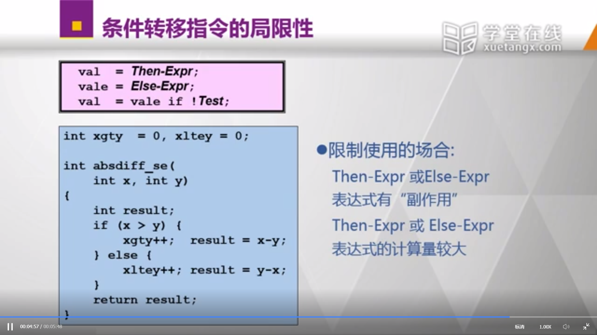

<u>**习题：**</u>




#### 循环的汇编语言表示-1

##### 如何实现循环（Loops）




##### "Do-While"循环






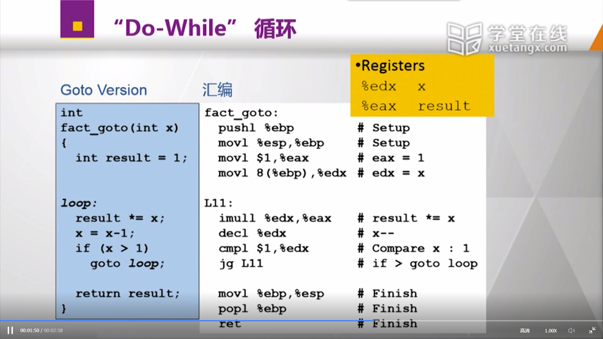

#### 循环的汇编语言表示-2

##### "While"循环（版本1）




##### "While"循环（版本2，do-while模式）gcc目前的模式




相当于一个判断`if (!(x > 1)) goto done;`加上一个<u>**do-while形式的定式**</u>：

```
loop:
	// 循环代码
	result *= x;
	x = x - 1;
	// do-while式判断
	if (x > 1)
		goto loop;
	
```

也就是说将do-while作为一个固定组成部分的定式来组成其他更加复杂的循环，如此处的while循环。

##### "For"循环







##### 补充




#### 循环的汇编语言表示-3



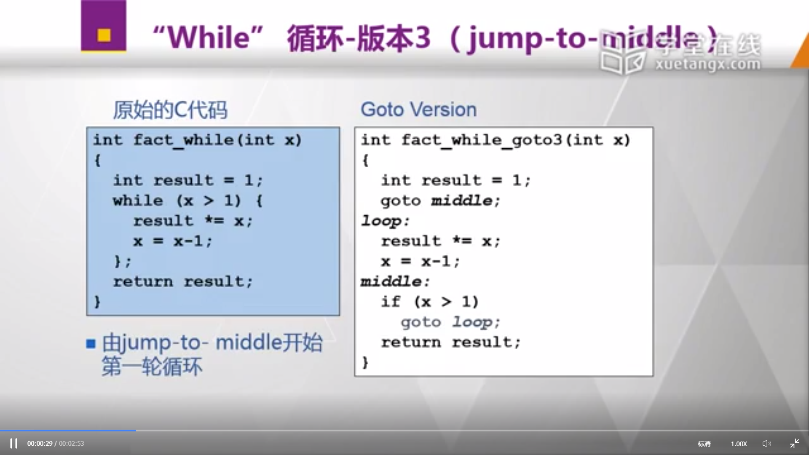

gcc 3.4.4










从外表看起来，从两条条件跳转指令变成了一条条件跳转指令+一条无条件跳转指令。貌似减少了开销（上面微体系结构背景中说明了条件跳转指令的开销来源）。

（但是，实际上条件跳转指令的运行次数是由程序的语义决定的。所以这个减少开销的说法，**实际上不太对**。）

#### 循环表示的体系结构背景




总的来说，根据历史信息来猜测，跳还是不跳。




c语言逻辑上是一条跳转指令，do-while形式转换为两条，即为`跳转历史信息 越碎片化，就越不利于提升预测精确度`。

#### switch的汇编语言表示-1







跳转表实现：




#### switch的汇编语言表示-2







<u>**注意间接跳转，即目标地址是存于内存地址中的，也就是MEM[计算结果]**</u>

#### switch的汇编语言表示-3







#### x86-64下的Switch语句




稀疏的不适合使用跳转表，用二叉树组织：







### 80x86汇编与C语言-3

#### 程序运行栈的基本操作-1

##### x86-32的程序运行栈

<u>**！！！栈顶是低地址！！！**</u>




##### 压栈操作







#### 程序运行栈的基本操作-2

##### 过程调用

先被调用的后返回，后被调用的先返回。和栈的工作原理很像。




##### 过程调用实例







#### 过程调用与栈

##### 基于栈的编程语言

重要的基本说明：




##### 连续过程调用示例



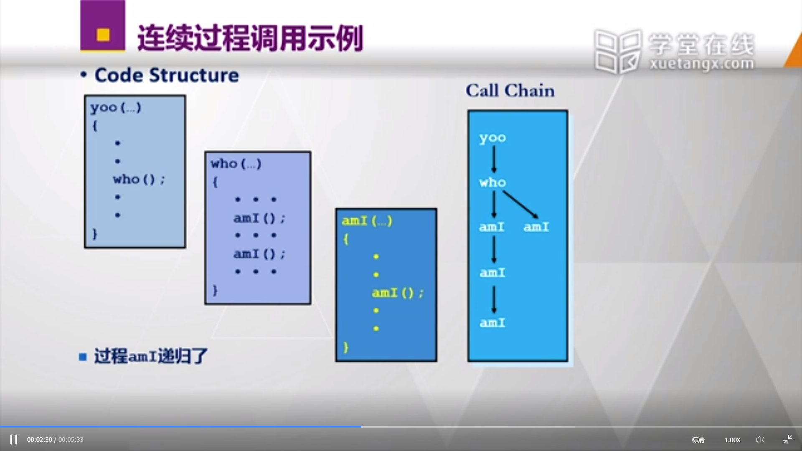

##### 栈帧

本课堂认为ebp作为栈帧的基址。

ebp和esp指明了栈帧。




##### 过程调用时栈的变化










#### 栈帧

##### x86-32/Linux下的栈帧（不同标准下不同）

自顶向下是自“栈顶”

<u>**非常非常重要**</u>




<u>**！！！一定一定要注意！！！**</u>：当前过程的输入参数是保存在父过程中的，也就是上图中的Arguments，所谓子过程参数“Argument build"同理就是本过程的子过程的输入参数保存的位置。<u>同时，参数保存的顺序是**从右往左**的顺序，所以越右的参数，位置越低。</u>

#### 一个实例

##### 回顾下swap过程

call：




建立栈帧：




具体过程：















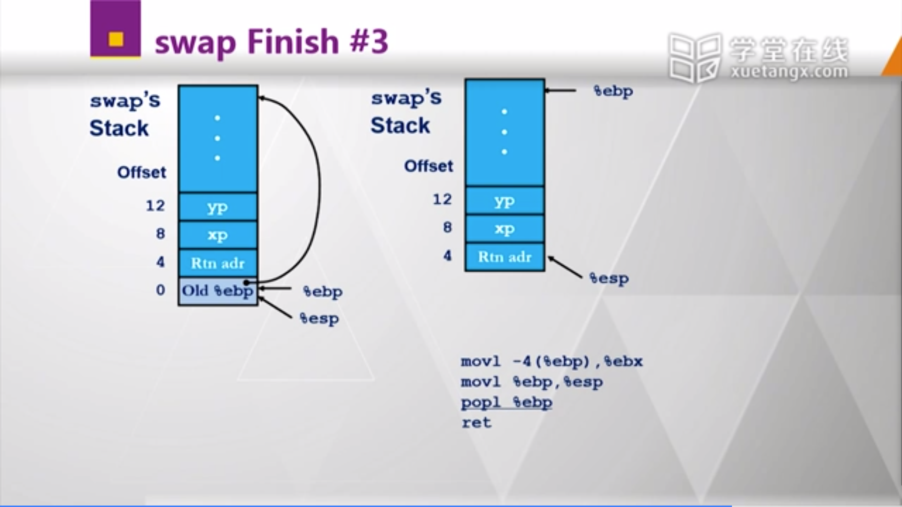




为什么不保存/恢复%eax,%ecx或者%edx，参照下面一节：

#### 寄存器使用惯例




笨办法就是全部都保存一遍，但是效率不高，所以<u>**引入了约定**</u>：

分为被调用者和调用者







%eax保存返回值，%ebp保存上一个%ebp

#### 一个递归调用的实例-1







#### 一个递归调用的实例-2













#### 另一个递归调用的实例









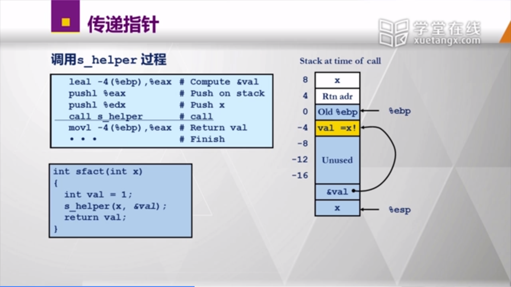




#### x86-32过程调用小结




### 80x86汇编与C语言-3（续）

#### x86-64过程调用与运行栈-1




实际上新的gcc中，%ebp也被释放了，不再作为特殊寄存器。

但是本课程还是认为%ebp保存栈帧的基址。？？？貌似？？？




#### x86-64过程调用与运行栈-2







#### x86-64过程调用与运行栈-3




从%rsp往下128字节可以供函数使用，而不用改变%rsp。




（1）可以看到call之前并没有分配栈帧

（2）新增相对于程序指令寄存器的寻址，%rip也可以作为数据基址。




只使用jmp

当swap返回时，相当于直接从孙子过程返回到祖父过程，该祖父过程为调用swap_ele的过程。

#### x86-64过程调用与运行栈-4










<u>**延迟分配**</u>：先用%rsp，再分配栈帧，比如上面先使用`movq %rbx, -16(%rsp)`和`movq %r12, -8(%rsp)`保存%rbx和%r12，然后再用`subq $16, %rsp`分配栈帧。

当然最后要恢复寄存器和%rsp。

这说明x86-64下的栈帧有一些不同的操作，见下方。

#### x86-64过程调用与运行栈-5




红（洪？反正是hong）区：一个进程可以拥有多个栈，某个栈当前的%rsp减去128字节这个空间默认是当前的栈空间，不会冲突，是安全的（说得很迷惑）。







### 80x86汇编与C语言-4

#### 数组的存储


#### 数组的访问-1

以下标形式：


#### 数组的访问-2

以指针形式：


第i行和第i+1行是连续存储的。  

#### 数组的访问-3


#### 数组的访问-4


指针数组，且该数组的每个元素又指向一个数组。

**明显**，cmu、mit和ucb**实际上并不一定连续存储**

#### 数组的访问-5

两次访问内存。

 


#### 二维数组示例-1


第二个没说：


以上为编译时即固定的N\*N = 16\*16的固定数组，C代表每一行有多少个基本元素（即C=N），K代表每个基本元素大小。

#### 二维数组示例-2

N是一个变量的情况：


n是一个变量，无法事先知道，故在需要进行乘法等运算时，使用imull这种指令。

（但是，你这个可变数组的长度怎么分配啊）

#### 二维数组示例-3

Fixed Array访问的优化：

取出其中一列：


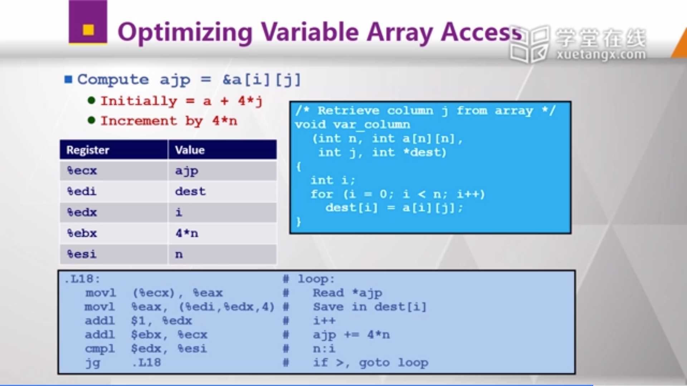

练习题：从反汇编推出C中欠缺的？？？。


（还是没有讨论变长数组在内存空间中如何进行分配，但是说明了存储和访问的方式和固定数组是相同的）

### 80x86汇编与C语言-4（续）

#### 结构的存储-1

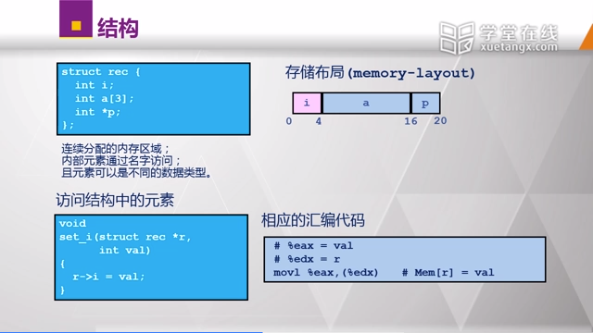


#### 结构的存储-2


主要看看为什么需要对齐：为了防止跨块访问所导致的额外内存访问。


#### 结构的存储-3


必须满足的三点，都需要注意。

其中第三点需要注意：结构的起始地址必须为k的整数倍，是由第二点要求的推论得来的。**而结构长度必须为k的整数倍则是一个硬性要求（当然不知道为什么），通过写代码测试了的，如果按照结构中各个元素的对齐要求进行对齐后，结构长度不为k的整数倍，那么就需要补上相应的字节使之满足k的整数倍。**比如：

```
struct s {
	double v;
	char c;
	int i[2];
}
```

虽然按照补齐规则得到的长度为20（8+1+3space+2*4 = 20），但是最终该结构体的长度也是24，说明在后面进行了补齐使之成为8的3倍。


#### 结构的存储-4

...这节就讲了上节自己想的问题...


#### 结构数组的存储

会不会结构体的长度需要为k（其中元素最大对齐要求为k）的整数倍，就是为了结构数组能够直接对齐？而不需要浪费空字节？？？。


说实话，有时候老师的ppt和讲解挺让人迷惑的...

这里12\*i = 4\*(i+2i)中的i就是下面的idx，而12就是一个结构体所占的字节。所以12\*i就是相对于a_start_addr的索引为idx的结构体起始地址的偏移量。而4\*(i+2i)只是说将12\*i分解为这样一种相乘的形式，方便计算，有时候不一定能和直观的意义联系起来（在这里我觉得这样写会更好：4\*(1+1+1)*i，表示2个short补齐为4字节，而float本身就为4字节，同时有i个结构体）。

#### 数据结构的存储小结


## 四、汇编编程 

### 80x86汇编编程-1

#### hello world-1


#### 汇编指示-1


#### 汇编指示-2


#### hello world-2


堆栈界限栈顶对齐方式为2^2=4字节对齐，降低栈对齐的要求。


加了一个省略ebp的开关，和64位类似。进一步缩减。

#### C程序的内存分布


08以下大概是操作系统内核。


上面的32位，这张是64位的。

#### 第一个汇编编程程序-1


报错建议打sudo apt-get install g++-multilib


#### 第一个汇编编程程序-2


此处，edx代表写入长度，ecx代表字符串起始地址，`movl $1, %ebx`表示写入到1号输出，也就是标准输出。


接着是程序退出，也就是调用1号程序（对应`movl $1, %eax`），其中返回值为0（对应`movl $0, %ebx`）。

#### 系统调用


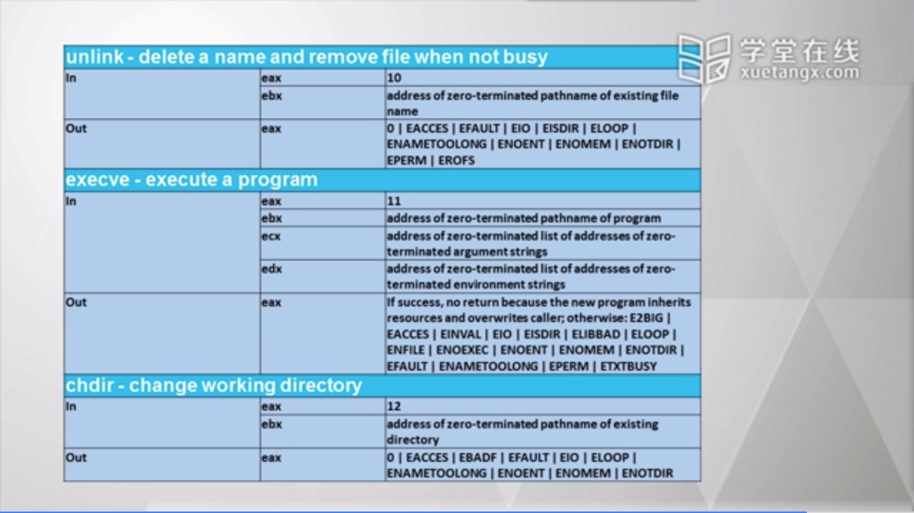


[关于x86-32 linux系统调用的参考资料](http://syscalls.kernelgrok.com/)

#### 汇编编程示例-处理命令行参数


当找到`\0`的时候，把`\0`换成`$10`，也就是换行符。

对应上一个示例中打印的系统调用，`%ecx`是字符串起始地址，`%edx`是字符串长度（不然看不明白的）。

#### 汇编编程示例-调用libc库函数

通过汇编调用C的库函数。


* `.asciz`是自动在字符串后面加一个`\0`，z是zero的意思。

* 程序具有不同类型的数据段，`.bss`是可读写且没有初始化的数据区。
* cpuid指令
* `.lcomm`声明了一个长度为12的buffer(不知何为`.lcomm`)


当然还有`.rodata`只读数据段之类的。

对于`.data`和`.bss`，如果带有初始值，那么在程序中就必须占用对应大小的空间，但是无需初始值的话，就可以只是声明一下，不占用程序空间。

#### 汇编编程小结


`.bss`段优点就是节省磁盘空间。

#### 补充-算术操作指令


练习题（没看）：找到最大的数。


`cltd`也叫做`ctd`，进行<u>**带符号位**</u>拓展。

`imull`&`mull`和 `idivl`&`divl`分别表示有符号和无符号的乘法以及除法。

#### 汇编编程示例-过程调用-1

汇编过程调用对于传参没有完全确定的规范，但是最好选择C语言的传参规范，方便相互调用。

C语言由调用者负责<u>**栈顶的恢复**</u>，所以在`call`后需要`addl $8, %esp`。


#### 汇编编程示例-过程调用-2


说明power这个符号是一个函数`function`。

### 80x86汇编编程-1（续）

#### 汇编编程示例-递归调用


#### 汇编编程示例-文件处理-1


类似于常量或者说宏。


#### 汇编编程示例-文件处理-2


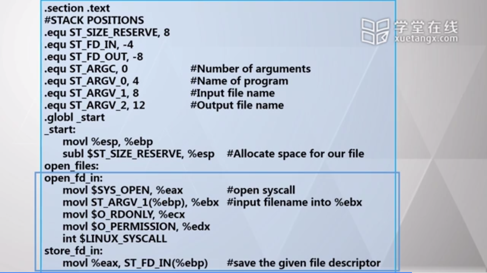

#### 汇编编程示例-文件处理-3

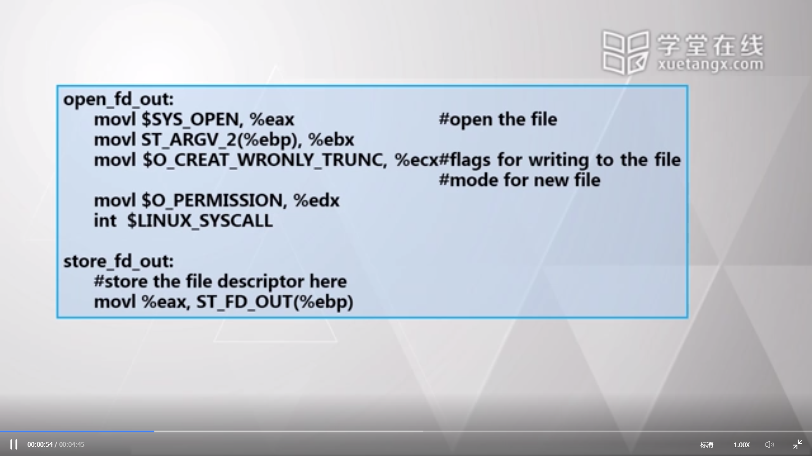


#### 汇编编程示例-文件处理-4 

####  

#### Vid汇编编程示例-文件处理-5

#### 汇编编程示例-文件处理-6

#### 汇编编程示例-文件处理-7

#### 汇编编程示例-文件处理-8

#### 汇编编程示例-共享库文件

### 80x86汇编编程-2（程序链接）

#### 程序链接-1

#### 程序链接-2

#### 程序链接-3

#### 程序链接-4

#### 程序链接-5

#### 程序链接-6

#### 程序链接-7

#### 程序链接-8

#### 程序链接-9

#### 程序链接-10

#### 程序链接-11

### 80x86汇编编程-2（内存管理）

#### 汇编编程示例-内存管理-1

#### 汇编编程示例-内存管理-2

#### 汇编编程示例-内存管理-3

#### 汇编编程示例-内存管理-4

#### 汇编编程示例-内存管理-5

## 五、MIPS汇编

### MIPS32架构与指令集初步

#### MIPS32架构与指令集初步-1

#### MIPS32架构与指令集初步-2

#### MIPS32架构与指令集初步-3

#### MIPS32架构与指令集初步-4

#### MIPS32架构与指令集初步-5

#### MIPS32架构与指令集初步-6

#### MIPS32架构与指令集初步-7

#### MIPS32架构与指令集初步-8

### MIPS32指令集与编程

#### MIPS32指令集与编程-1

#### MIPS32指令集与编程-2

#### MIPS32指令集与编程-3

#### MIPS32指令集与编程-4

#### MIPS32指令集与编程-5

#### MIPS32指令集与编程-6

#### MIPS32指令集与编程-7

### MIPS32异常处理

#### 基本概念

#### 异常处理向量

#### 异常处理流程

#### 异常处理实例

### 虚存与MIPS32内存管理

#### 虚存设计背景

#### 虚存设计背景详述-1

#### 虚存设计背景详述-2

#### 虚存地址转换

#### MIPS32内存管理-1

#### MIPS32内存管理-2